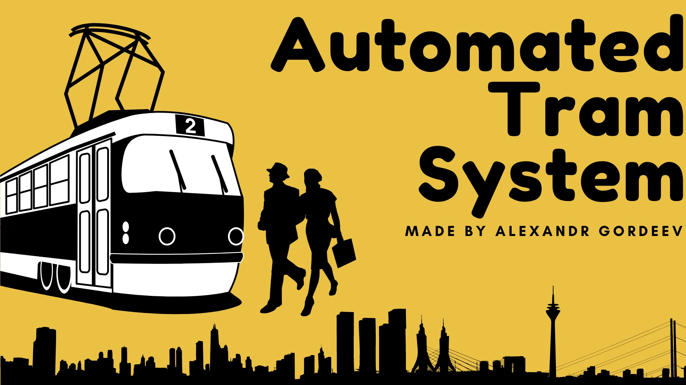
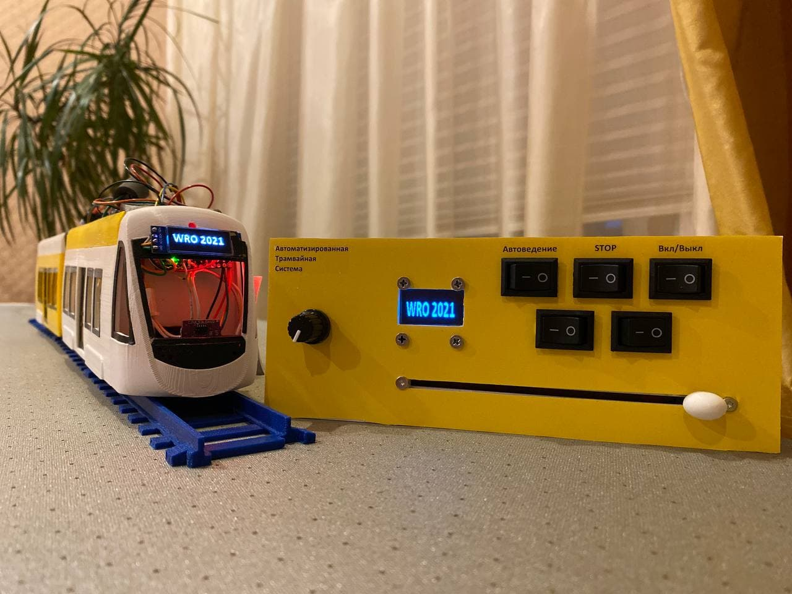
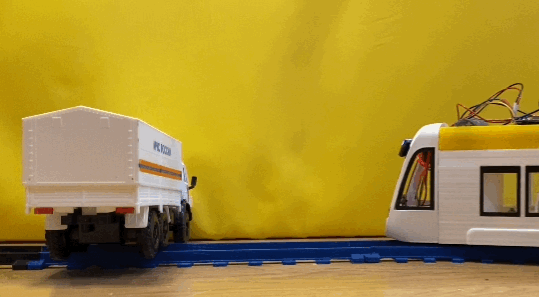
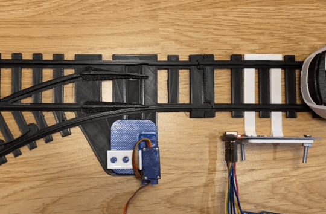
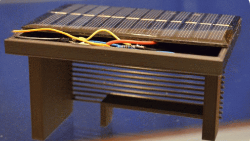

 [Watch the Project Demo on YouTube](https://youtu.be/tfnsq6qUQj4)

## Overview

This project is a fully autonomous tram system prototype developed individually as an embedded systems engineering project.

The system demonstrates autonomous vehicle control, infrastructure automation, and energy efficiency solutions for urban rail transport under real-time and hardware constraints.

The prototype includes automated tram control, traffic lights, switches, stops, and an energy recovery concept implemented using embedded systems.

## Objectives

- Develop autonomous and remote tram control

- Automate tram infrastructure (switches, traffic lights, stops)

- Build a working physical prototype

- Analyze energy consumption and recovery in tram systems

## Hardware

  

- Arduino Nano (multiple controllers)

- Motor driver: TB6612FNG

- Wireless communication: NRF24L01

- Laser rangefinder: VL53L0X

- Reed switches, potentiometers

- Servo motors (switches)

- DC motor with gearbox

- Custom PCB (designed in EasyEDA)

- 3D-printed tram body, rails, infrastructure

## Mechanical Design & Credits

The physical prototype is constructed using a hybrid of open-source assets and custom-engineered parts.

**External Assets (Tram & Rails)**
The base design for the **Tram Body** and **Rails** was created by **Depronized**.
* **Sources:**
  * [Tram Body (Thingiverse)](https://www.thingiverse.com/thing:3194215)
  * [Rails (Thingiverse)](https://www.thingiverse.com/thing:2146361)
  * [Track Switch (Thingiverse)](https://www.thingiverse.com/thing:2619888)
* **License:** CC BY-NC 4.0
* *Note: 3D model files (original or modified) are not included in this repository to respect the licensing terms. Please refer to the source links above for the original designs.*

**Modifications & Custom Engineering**
I significantly modified and expanded upon the base design to support the project requirements:
* **Modifications:** Redesigned the tram car and cabin details to mount the specific electronics.
* **Original Designs:** I designed the following components from scratch:
    * Traffic Lights
    * RFID Sensor and Reed Switch Mounts
    * Rail Cross-Intersections
    * Remote controller case

  

## Software

- Language: C++

- Platform: Arduino

- Modular control logic for tram and infrastructure

- Real-time loop-based control without external frameworks

## System Architecture

The system uses multiple Arduino controllers responsible for:

- Tram movement and obstacle detection

- Switch and traffic light control

- Stop management and intervals

- Emergency and manual override

Wireless communication ensures coordination between tram and infrastructure.

## Key Algorithms and Logic

- Autonomous navigation along rails

- Obstacle detection and emergency stop using laser rangefinder

- Fixed-interval tram scheduling independent of entry point

- Fail-safe logic with manual control fallback

- Anti-jam door control system

### System Logic in Action

**1. Obstacle Detection & Emergency Stop**
*(The tram detects an object via VL53L0X and halts immediately)*

**2. Autonomous Switching & RFID Logic**
*(The system reads the RFID tag and switches the track automatically)*

## Energy Efficiency Concepts

- Regenerative braking with flywheel energy storage (FES)

- Energy harvesting at stops using piezoelectric elements

- Solar panels on stops for auxiliary power

- Analysis of braking energy reuse for tram acceleration

**Solar panels at the tram stops**

## Challenges and Engineering Decisions

- Sensor noise handled with thresholding and filtering

- Real-time constraints addressed by optimized control loops

- Safety prioritized through manual override and system isolation

- Cost optimization using low-cost embedded components

## Results

- Fully working autonomous tram prototype

- Automated infrastructure interaction

- Demonstrated feasibility of energy recovery

## What I Would Improve Today

- Transition to a formal state machine architecture

- More robust sensor fusion

- CAN or RS485 instead of NRF for industrial reliability

- Improved modularity and scalability

## Background

This project was originally developed as an individual robotics competition project.

It won the national World Robot Olympiad (WRO) final in Russia and was later presented at the international WRO 2021 final, where I represented my country.

